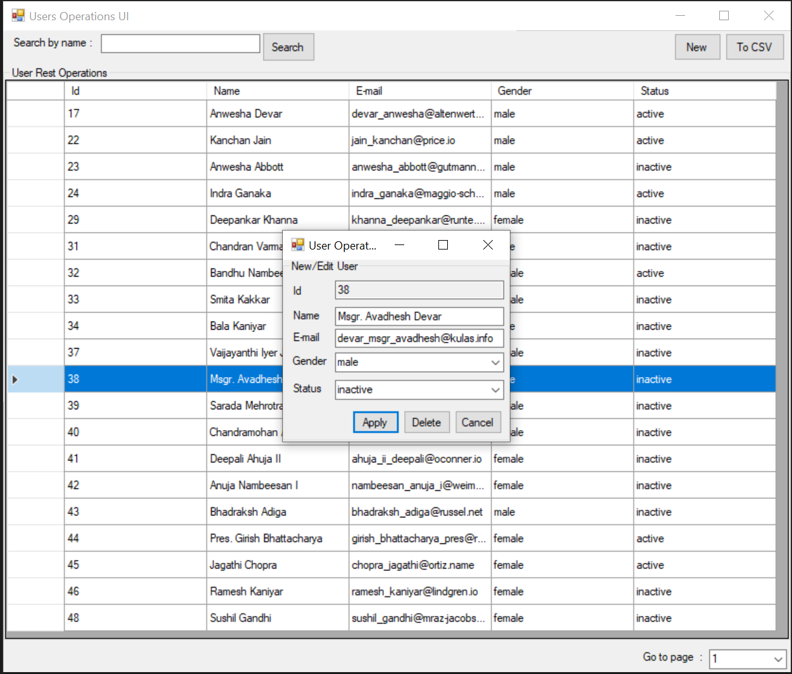

# UPS_Sample
Rest service (https://gorest.co.in) + windows forms app sample

# Dependencies
RestSharp - The main purpose of RestSharp is to make synchronous and asynchronous calls to remote resources over HTTP. Full documentation is at https://restsharp.dev

## Screenshot

